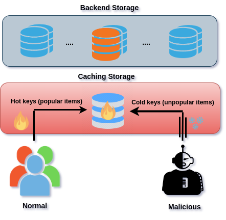

# In-Network Impact of E-Commerce Bot Traffic

The rapid growth of e-commerce has led to an increased
prevalence of automated bots engaging in fraudulent activ-
ities. Despite online businesses’ continuous efforts
to enhance user experience through the adoption of modern
technologies the disruptive presence of malicious bots
poses a significant threat to the revenue and overall success of
companies. we review the characteristics of bot traffic in real-world e-commerce websites and analyze how these characteristics can bring vulnerability while using in-network
caching in the backend. We outline how the presence of bot traffic can lead to higher cache misses of legitimate users. As depicted, regular users typically request popular items, leading to the storage of these items within the in-network caching system. However, malicious bots follow a different pattern, actively soliciting less popular items and
attempting to inject counterfeit popular items into the caching system.

Gaining access to data for research in e-commerce and
related areas like search and recommendation has proven to
be a challenging endeavor. We conducted an analysis on several pre-existing datasets such as Twibot-20 [1], bot-net [2], Amazon [3], and Alibaba benchmark generator [4]. However, these datasets did not meet our criteria due to either lacking sufficient annotations or lacking essential query and user information. As a result, we conducted a thorough review, which encompassed an analysis
of the characteristics of the web requests, web traffic, workload, bot traffic, and network caches. Then,
we formulated a set of guiding principles for the precise generation of a bot traffic dataset. The following are the key
principles we adhered to during the dataset creation process:

1- Search queries made by bots are often long search queries and tend to search for not so popular items in the e-commerce search engine. 

2- User requests follow a Zipfian distribution. This observation signifies that specific segments of the data experience
a higher volume of requests, a pattern that evolves over time.

3- The average time interval between consecutive requests made by bots is five times shorter than normal users.

To create a bot dataset in accordance with our learning guidelines, we utilized a Zipfian request distribution with an alpha value of 0.9, as detailed in the zipfian folder. This folder contains essential information for generating keys based on the Zipfian distribution. Bots primarily send requests for less popular keys, while legitimate users focus on popular items.

Additionally, the interarrival time between requests adheres to a normal distribution. Notably, bots exhibit a shorter interarrival time compared to legitimate users. The necessary details for generating interarrival time are available in the time folder.

## Refrences

[1] Shangbin Feng, Herun Wan, Ningnan Wang, Jundong Li, and Minnan
Luo. Twibot-20: A comprehensive twitter bot detection benchmark. In
Proceedings of the 30th ACM International Conference on Information
& Knowledge Management, pages 4485–4494, 2021.

[2] Elaheh Biglar Beigi, Hossein Hadian Jazi, Natalia Stakhanova, and Ali A
Ghorbani. Towards effective feature selection in machine learning-
based botnet detection approaches. In 2014 IEEE Conference on
Communications and Network Security, pages 247–255. IEEE, 2014. 

[3] Amazon. Shopping queries dataset: A large-scale esci benchmark for
improving product search. https://github.com/amazon-science/esci-data,
2022.

[4] Alibaba. e-commerce search benchmark. https://github.com/alibaba/eCommerceSearchBench, 2020.
