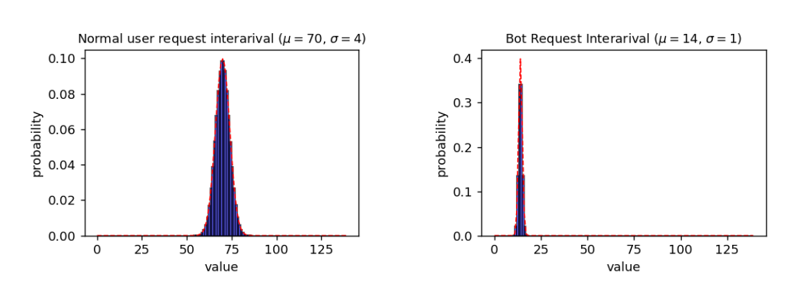

The average time interval between consecutive requests made by bots is five times shorter than normal users. Consequently, we incorporate this factor into our request generation process, producing two distinct sets of time intervals for normal and bot traffic. As depicted,
normal users follow a Gaussian distribution with parameters μ=70 and σ=4, while bot requests are characterized by parameters μ=14 and σ=1. μ represents the mean or average value of the distribution, and σ is standard deviation which shows the dispersion of the data points in the distribution.