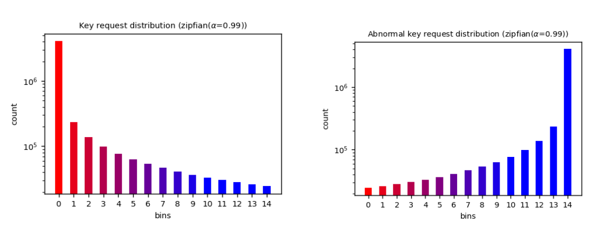

User requests follow a Zipfian distribution. This observation signifies that specific segments of the data experience a higher volume of requests, a pattern that evolves over
time. To mimic user behavior accurately, we proceeded to
generate 5 million requests using a Zipfian distribution with
a α= 0.9. As illustrated, the distributions of keys for normal and bots. As can be seen, there are more request for some part of data (i.e., popular/hot items) and less request for some other (i.e., unpopular/cold items). However, as shows, cold items for normal users consider as hot items for bots.

